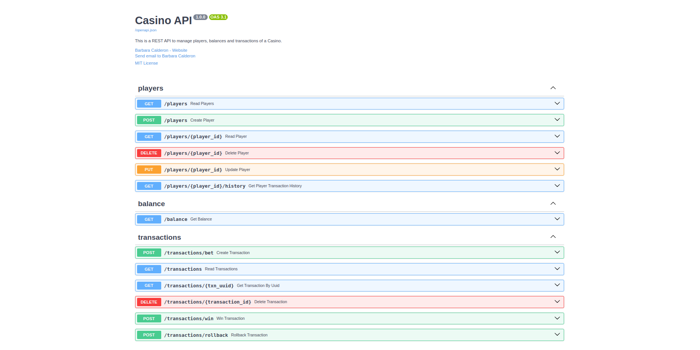
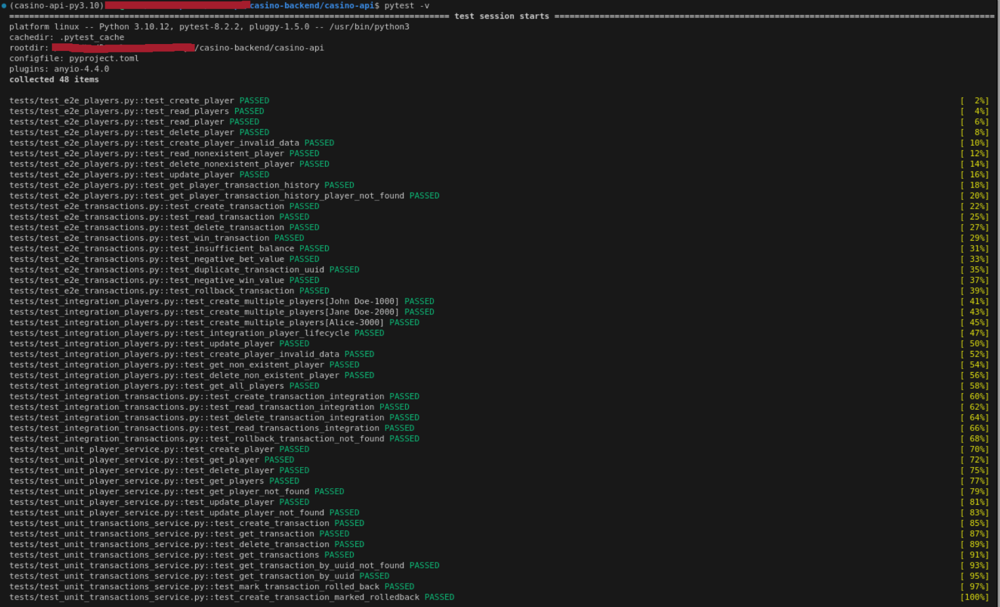

_(Versão em Português | [Clique aqui para a versão em Inglês.](https://github.com/barbaracalderon/casino-backend/blob/main/README-en.md))_

# The Casino REST API

This project is a REST API that simulates services for casino users.

It was developed in Python using the FastAPI framework and PostgreSQL database.

It includes end-to-end (e2e), integration, and unit tests to ensure code robustness and quality. Tests were developed using Pytest. Additionally, this project uses Docker Compose to orchestrate two containerized services: casino-api (`localhost:3001`) and postgresql-data (`localhost:5433`) with password `example` for access.



The objectives of this project are:

- Have code published for general access on the Github platform
- Use of `commit patterns`
- Use of the FastAPI framework for backend application development
- Use of Pytest for end-to-end, integration, and unit test development
- API responses to be in JSON format
- Application containerization using Docker and Docker Compose for orchestration
- API documented with OpenAPI Swagger standard (`localhost:3001/docs`)
- Definition of general endpoints `/players`, `/balance`, `/bet`, `/win`, `/rollback`, and `/history` and their respective specifics
- Validation of non-negative values
- Validation of player existence
- Data persistence with PostgreSQL relational database
- Code structure and readability: structure developed with `models`, `schemas`, `routes`, `services`, `repositories`, and `exceptions`

## Author
Barbara Calderon, software developer.

- [Github](https://www.github.com/barbaracalderon)
- [LinkedIn](https://www.linkedin.com/in/barbaracalderondev)
- [Twitter](https://www.x.com/bederoni)

## Table of Contents
1. [Technologies Used](#technologies-used)
2. [Project Structure](#project-structure)
3. [Running Locally with Docker Compose](#running-locally-with-docker-compose)
4. [Running Tests with Pytest](#running-tests-with-pytest)
5. [Application Endpoints Casino API](#application-endpoints-casino-api)

## Technologies Used

- **Language**: Python
- **Framework**: FastAPI
- **Database**: PostgreSQL
- **Management**: Poetry
- **Main Dependencies**:
    - **Pydantic**: Used for data validation and serialization.
    - **Psycopg-binary**: Driver for communication with PostgreSQL database.
    - **SQLAlchemy**: ORM (Object-Relational Mapping) to interact with the database more intuitively.
    - **Asyncpg**: Asynchronous driver for PostgreSQL, used for asynchronous database operations.
    - **Pytest**: Testing framework used to write and execute tests.

## Project Structure

The project is containerized into two main services:
- **casino-api**: contains the FastAPI application (`app/`) and tests (`tests/`).
- **postgresql-data**: contains the persisted data in PostgreSQL database.

### Dockerfile
The `casino-api` directory has a `Dockerfile` to create the Docker image of the application.

### Docker Compose
The project uses `docker-compose.yml` to orchestrate the `casino-api` and `postgresql-data` containers.

### Dependencies
The project was developed using `poetry`, which manages dependencies, and also `pytest` for testing.

## Running Locally with Docker Compose

To run the project locally, follow these steps:

1. Have Docker and Docker Compose installed on your machine.

2. Clone the repository:

```bash
git clone git@github.com:barbaracalderon/casino-backend.git
```

3. Navigate to the project directory:

```bash
cd casino-backend/
```

4. Create the postgresql-data directory to automatically synchronize data from postgresql container:

 ```bash
 mkdir postgresql-data
 ```

5. Execute Docker Compose to bring up the containers:

```bash
docker-compose up --build
```

_If you encounter issues with the above command, you may need to use `sudo docker-compose up --build`_

6. In the browser, the casino-api service is available at:

```bash
localhost:3001
```

7. PTo access the OpenAPI Swagger documentation:

```bash
localhost:3001/docs
```

8. To access the database in Pg4Admin (if you wish), you need to define a server with database name, password, and address:port.

```bash
database = 'casino'
password = 'example'
localhost:5433
```

## Running Tests with Pytest

1. To run tests, navigate to the directory:

```bash
cd casino-backend/casino-api
```

2. Run the test command:

```bash
pytest -v
```




## Application Endpoints


| HTTP Method | Endpoint                    | Description                                                  |
|-------------|-----------------------------|--------------------------------------------------------------|
| POST        | /players                    | Creates a new player.                                         |
| GET         | /players                    | Retrieves the list of players.                                |
| GET         | /players/{player_id}        | Retrieves details of a specific player.                       |
| DELETE      | /players/{player_id}        | Deletes a specific player.                                    |
| PUT         | /players/{player_id}        | Updates information of a specific player.                     |
| GET         | /players/{player_id}/history | Retrieves transaction history of a specific player.          |
| GET         | /balance                    | Retrieves the balance of a specific player.                   |
| POST        | /transactions/bet           | Creates a new bet.                                            |
| GET         | /transactions               | Retrieves the list of transactions.                           |
| GET         | /transactions/{txn_uuid}    | Retrieves details of a specific transaction.                  |
| DELETE      | /transactions/{transaction_id} | Deletes a specific transaction.                            |
| POST        | /transactions/win           | Registers a win for a balance.                                |
| POST        | /transactions/rollback      | Performs a rollback of a transaction.                         |


## Final remarks

The project developed using FastAPI, PostgreSQL, Poetry, Pytest, and Docker represents a solution for managing transactions and players in a virtual casino environment. Choosing FastAPI enabled the development of an API leveraging modern Python features. PostgreSQL was used for data persistence, ensuring integrity and reliability in database operations.

The use of Poetry simplified dependency management, offering a consistent development environment and facilitating project maintenance. Implementation of unit, integration, and end-to-end tests with Pytest ensured the application functioned as expected across different scenarios.

The structured organization in models, exceptions, routes, services, repositories, and schemas aims to provide clean, modular, and maintainable code. Additionally, containerization with Docker and orchestration via Docker Compose enables portability, facilitating deployment in different environments.

In summary, this project dealt with building a REST API with dependency management and database management, implementing tests, and sought structural organization with code readability.

Barbara Calderon.
