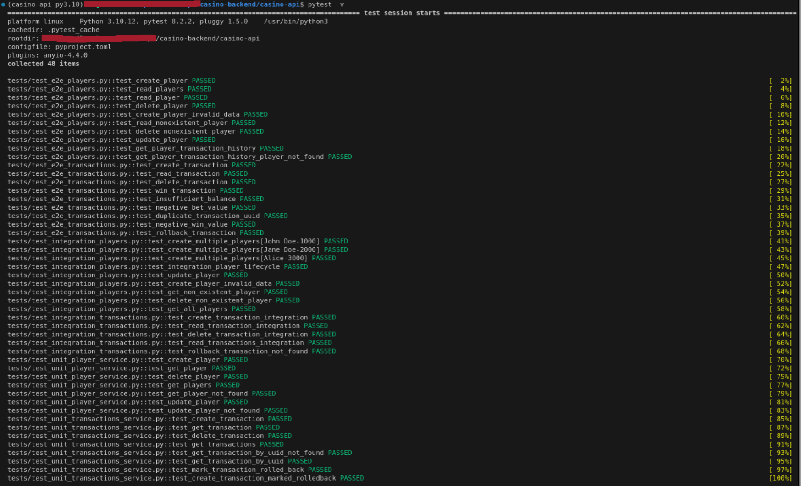

_(Portuguese version | [Click here for the English version.](https://github.com/barbaracalderon/casino-backend/blob/main/README-en.md))_

# The Casino REST API

Este projeto é uma API REST que simula serviços para usuários cassinos. 

Foi desenvolvido em Python usando o framework FastAPI e banco de dados PostgreSQL. 

Ele inclui testes de ponta-a-ponta (e2e), testes de integração e testes unitários para garantir a robustez e a qualidade do código. Os testes foram desenvolvidos utilizando o Pytest. Além disso, este projeto utiliza Docker Compose para orquestrar dois serviços conteinirizados: casino-api (`localhost:3001`) e postgresql-data (`localhost:5433`) e senha `example` para acesso.


Os objetivos desse projeto são:

- Ter código publicado para acesso geral na plataforma Github
- Utilizar `commit patterns`
- Uso do framework FastAPI para o desenvolvimento da aplicação backend
- Uso do Pytest para desenvolvimento de testes ponta-a-ponta, integração e unitários
- Respostas das requisições à API devem ser no formato JSON
- Aplicação em contêineres com uso de Docker e Docker Compose para orquestração
- API documentada com padrão Swagger da OpenAPI (`localhost:3001/docs`)
- Definição dos endpoints gerais `/players`, `/balance`, `/bet`, `/win`, `/rollback` e `/history` e suas respectivas especificidades
- Validação de valores não-negativos
- Validação de existência de jogador
- Persistência de dados com banco de dados relacional PostgreSQL
- Estruturação e legibilidade de código: estrutura desenvolvida com `models`, `schemas`, `routes`, `services`, `repositories` e `exceptions`

## Autor
Barbara Calderon, desenvolvedora de software.

- [Github](https://www.github.com/barbaracalderon)
- [LinkedIn](https://www.linkedin.com/in/barbaracalderondev)
- [Twitter](https://www.x.com/bederoni)

## índice
1. [Tecnologias utilizadas](#tecnologias-utilizadas)
2. [Estrutura do Projeto](#estrutura-do-projeto)
3. [Executar localmente com Docker Compose](#executando-localmente-com-docker-compose)
4. [Executar testes com Pytest](#executando-testes-com-pytest)
5. [Endpoints da aplicação Casino API](#endpoints-da-aplicação-casino-api)


## Tecnologias utilizadas

- **Linguagem**: Python
- **Framework**: FastAPI
- **Banco de dados**: PostgreSQL
- **Gerenciamento**: Poetry
- **Dependências principais**:
    - **Pydantic**: Utilizado para a validação e serialização de dados.
    - **Psycopg-binary**: Driver para comunicação com o banco de dados PostgreSQL.
    - **SQLAlchemy**: ORM (Object-Relational Mapping) para interagir com o banco de dados de maneira mais intuitiva.
    - **Asyncpg**: Driver assíncrono para PostgreSQL, utilizado para operações de banco de dados assíncronas.
    - **Pytest**: Framework de testes utilizado para escrever e executar testes.

## Estrutura do Projeto

O projeto está conteinerizado em dois serviços principais:
- **casino-api**: contém o aplicativo FastAPI (`app/`) e os testes (`tests/`).
- **postgresql-data**: contém os dados persistidos no banco de dados PostgreSQL.

### Dockerfile
O diretório `casino-api` possui um `Dockerfile` para criar a imagem Docker do aplicativo.

### Docker Compose
O projeto utiliza o `docker-compose.yml` para orquestrar os contêineres `casino-api` e `postgresql-data`.

### Dependências
O projeto foi desenvolvido utilizando o `poetry`, que gerencia as dependências e também o `pytest` para os testes.

## Executar localmente com Docker Compose

Para rodar o projeto localmente, siga os passos abaixo:

1. Tenha o Docker e o Docker Compose instalados na sua máquina.

2. Clone o repositório:

```bash
git clone git@github.com:barbaracalderon/casino-backend.git
```

3. Navege até o diretório do projeto:

```bash
cd casino-backend/
```

4. Execute o Docker Compose para subir os contêineres:

```bash
docker-compose up --build
```

_Caso encontre problemas com o comando acima, talvez seja necessário usar `sudo docker-compose up --build`_

5. No navegador, o serviço casino-api está disponível no endereço:

```bash
localhost:3001
```

6. Para acessar a documentação Swagger da OpenAPI:

```bash
localhost:3001/docs
```

7. Para acessar o banco de dados no Pg4Admin, é preciso definir um server com nome do banco e dados, senha e endereço:porta:

```bash
banco de dados = 'casino'
senha = 'example'
localhost:5433
```

## Executando testes com Pytest

1. Para executar testes, navegue até o diretório:

```bash
cd casino-backend/casino-api
```

2. Execute o comando de teste:

```bash
pytest -v
```




## Endpoints da aplicação


| Método HTTP | Endpoint                    | Descrição                                                    |
|-------------|-----------------------------|--------------------------------------------------------------|
| POST        | /players                    | Cria um novo jogador.                                        |
| GET         | /players                    | Retorna a lista de jogadores.                                |
| GET         | /players/{player_id}        | Retorna os detalhes de um jogador específico.                |
| DELETE      | /players/{player_id}        | Deleta um jogador específico.                                |
| PUT         | /players/{player_id}        | Atualiza as informações de um jogador específico.            |
| GET         | /players/{player_id}/history | Retorna o histórico de transações de um jogador específico. |
| GET         | /balance                    | Retorna o saldo de um jogador específico.                    |
| POST        | /transactions/bet           | Cria uma nova aposta.                                        |
| GET         | /transactions               | Retorna a lista de transações.                               |
| GET         | /transactions/{txn_uuid}    | Retorna os detalhes de uma transação específica.             |
| DELETE      | /transactions/{transaction_id} | Deleta uma transação específica.                          |
| POST        | /transactions/win           | Registra um ganho para um balance.                           |
| POST        | /transactions/rollback      | Realiza o rollback de uma transação.                         |


## Considerações finais

O projeto desenvolvido utilizando FastAPI, PostgreSQL, Poetry, Pytest e Docker representa uma solução para gerenciar transações e jogadores em um ambiente de cassino virtual. A escolha do FastAPI permitiu o desenvolvimento de uma API que aproveita os recursos do Python moderno. O PostgreSQL foi utilizado para persistência de dados, garantindo integridade e confiabilidade nas operações de banco de dados.

O uso do Poetry simplificou a gestão de dependências, oferecendo um ambiente de desenvolvimento consistente e facilitando a manutenção do projeto. A implementação de testes de unidade, integração e ponta-a-ponta com o Pytest assegurou que a aplicação funcionasse conforme o esperado em diferentes cenários.

A estrutura organizada em models, exceptions, routes, services, repositories e schemas visa proporcionar um código limpo, modular e de fácil manutenção. Além disso, a containerização com Docker e a orquestração via Docker Compose possibilita a portabilidade, facilitando a implantação em diferentes ambientes.

Em resumo, este projeto lidou com construção de API REST com gestão de dependências e banco de dados, implementação de testes e buscou uma organização estrutural com legibilidade de código.

Barbara Calderon.